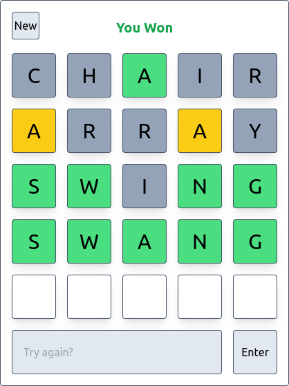

# React Wordle

This React Wordle was made by AFCM as a challenge.



## Running

Create your `.env` file with the random word API URL (as shown in `.env.exemple`)

Then you can run the project and access it on port 3000:

```sh
npm start
```
